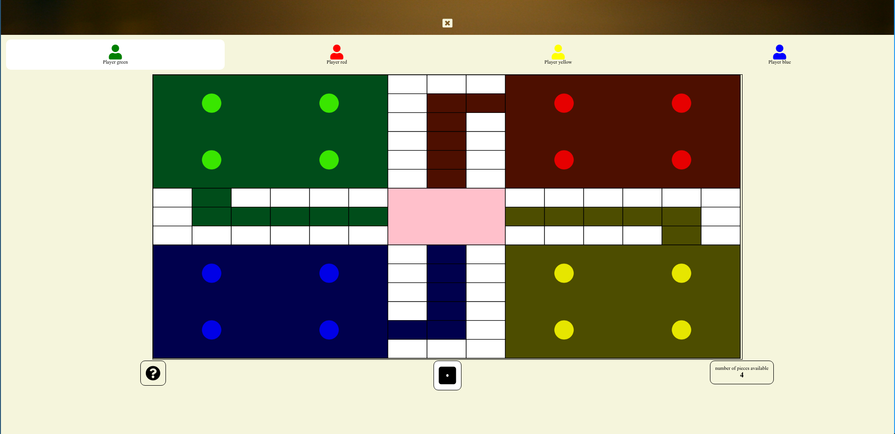
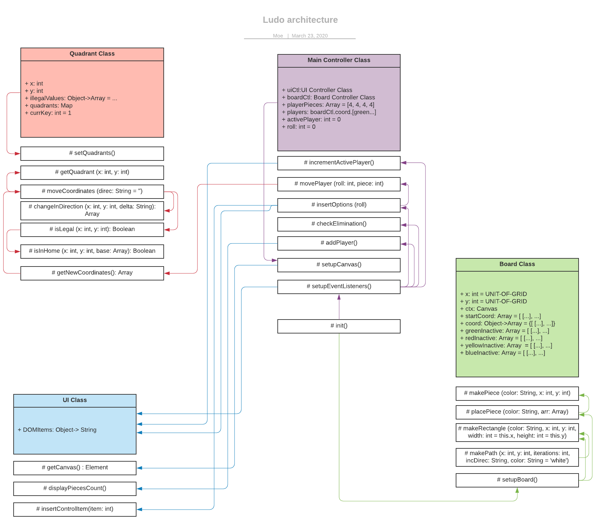

# LudoGame
## This is a simple Javascript ES6 game implementation of the popular board game 'Ludo'. This uses CSS Grid styling and the SASS preprocessor.

### *This is a work in progress but a minimal implementation*

> The following are features that need ot be implemented.

| Feature        | Debug required         |
| ------------- |:-------------:|
| elimination function     |  |
| overlapping pieces with current piece ontop | |

